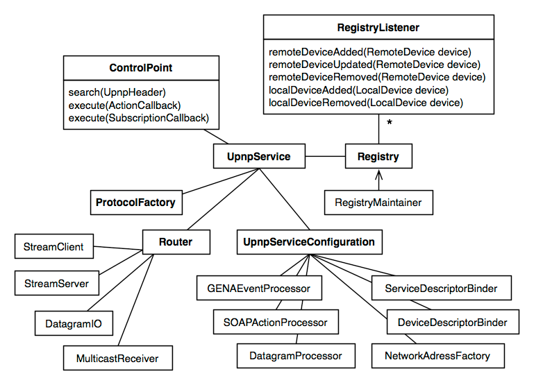
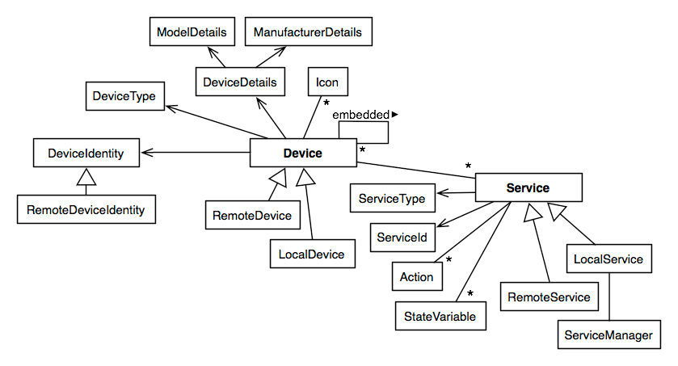

# The jUPnP Core API

The programming interface of jUPnP is fundamentally the same for UPnP clients and servers.
The single entry point for any program is the `UpnpService` instance.
Through this API you access the local UPnP stack, and either execute operations as a client (control point) or provide services to local or remote clients through the registry.

The following diagram shows the most important interfaces of jUPnP Core:



You'll be calling these interfaces to work with UPnP devices and interact with UPnP services.
jUPnP provides a fine-grained meta-model representing these artifacts:



In this chapter we'll walk through the API and metamodel in more detail, starting with the `UpnpService`.

## Working with a UpnpService

The `UpnpService` is an interface:

```java
public interface UpnpService {

    public UpnpServiceConfiguration getConfiguration();
    public ProtocolFactory getProtocolFactory();
    public Router getRouter();

    public ControlPoint getControlPoint();
    public Registry getRegistry();

    public void shutdown();

}
```

An instance of `UpnpService` represents a running UPnP stack, including all network listeners, background maintenance threads, and so on.
jUPnP Core bundles a default implementation which you can simply instantiate as follows:

```java
UpnpService upnpService = new UpnpServiceImpl();
```

With this implementation, the local UPnP stack is ready immediately, it listens on the network for UPnP messages.
You should call the `shutdown()` method when you no longer need the UPnP stack.
The bundled implementation will then cut all connections with remote event listeners and also notify all other UPnP participants on the network that your local services are no longer available.
If you do not shutdown your UPnP stack, remote control points might think that your services are still available until your earlier announcements expire.

The bundled implementation offers two additional constructors:

```java
UpnpService upnpService = new UpnpServiceImpl(RegistryListener... registryListeners);
```

This constructor accepts your custom `RegistryListener` instances, which will be activated immediately even before the UPnP stack listens on any network interface.
This means that you can be notified of *all* incoming device and service registrations as soon as the network stack is ready.
Note that this is rarely useful, you'd typically send search requests after the stack is up and running anyway - after adding listeners to the registry.

The second constructor supports customization of the UPnP stack configuration:

```java
UpnpService upnpService = new UpnpServiceImpl(new DefaultUpnpServiceConfiguration(8081));
```

This example configuration will change the TCP listening port of the UPnP stack to `8081`, the default being an ephemeral (system-selected free) port.
The `UpnpServiceConfiguration` is also an interface, in the example above you can see how the bundled default implementation is instantiated.

The following section explain the methods of the `UpnpService` interface and what they return in more detail.

### Customizing configuration settings
        
This is the configuration interface of the default UPnP stack in jUPnP Core, an instance of which you have to provide when creating the `UpnpServiceImpl`:
        
```java
public interface UpnpServiceConfiguration {

    // NETWORK
    public NetworkAddressFactory createNetworkAddressFactory();

    public StreamClient createStreamClient();
    public StreamServer createStreamServer(NetworkAddressFactory naf);

    public MulticastReceiver createMulticastReceiver(NetworkAddressFactory naf);
    public DatagramIO createDatagramIO(NetworkAddressFactory naf);

    // PROCESSORS
    public DatagramProcessor getDatagramProcessor();
    public SOAPActionProcessor getSoapActionProcessor();
    public GENAEventProcessor getGenaEventProcessor();

    // DESCRIPTORS
    public DeviceDescriptorBinder getDeviceDescriptorBinderUDA10();
    public ServiceDescriptorBinder getServiceDescriptorBinderUDA10();

    // EXECUTORS
    public Executor getMulticastReceiverExecutor();
    public Executor getDatagramIOExecutor();
    public Executor getStreamServerExecutor();
    public Executor getAsyncProtocolExecutor();
    public Executor getSyncProtocolExecutor();
    public Executor getRegistryMaintainerExecutor();
    public Executor getRegistryListenerExecutor();

    // REGISTRY
    public Namespace getNamespace();
    public int getRegistryMaintenanceIntervalMillis();
    ...
```
        
This is quite an extensive SPI but you typically won't implement it from scratch.
Overriding and customizing the bundled `DefaultUpnpServiceConfiguration` should suffice in most cases.

The configuration settings reflect the internal structure of jUPnP Core:
        
<dl>
    <dt>Network</dt>
    <dd>
        The `NetworkAddressFactory` provides the network interfaces, ports, and multicast settings which are used by the UPnP stack.
        At the time of writing, the following interfaces and IP addresses are ignored by the default configuration: any IPv6 interfaces and addresses, interfaces whose name is "vmnet*", "vnic*", "*virtual*", or "ppp*", and the local loopback.
        Otherwise, all interfaces and their TCP/IP addresses are used and bound.

        You can set the system property `org.jupnp.network.useInterfaces` to provide a comma-separated list of network interfaces you'd like to bind exclusively.
        Additionally, you can restrict the actual TCP/IP addresses to which the stack will bind with a comma-separated list of IP address provided through the `org.jupnp.network.useAddresses` system property.

        Furthermore, the configuration produces the network-level message receivers and senders, that is, the implementations used by the network `Router`.

        Stream messages are TCP/HTTP requests and responses, the default configuration will use the Sun JDK 6.0 webserver to listen for HTTP requests, and it sends HTTP requests with the standard JDK `HttpURLConnection`.
        This means there are by default no additional dependencies on any HTTP server/library by jUPnP Core.
        However, if you are trying to use jUPnP Core in a runtime container such as Tomcat, JBoss AS, or Glassfish, you might run into an error on startup.
        The error tells you that jUPnP couldn't use the Java JDK's `HTTPURLConnection` for HTTP client operations.
        This is an old and badly designed part of the JDK: Only "one application" in the whole JVM can configure URL connections.
        If your container is already using the `HTTPURLConnection`, you have to switch jUPnP to an alternative HTTP client.
        See [Configuring network transports](advanced.md#configuring-network-transports) for other available options and how to change various network-related settings.

        UDP unicast and multicast datagrams are received, parsed, and send by a custom implementation bundled with jUPnP Core that does not require any particular Sun JDK classes, they should work an all platforms and in any environment.
    </dd>
    <dt>Processors</dt>
    <dd>
        The payload of SSDP datagrams is handled by a default processor, you rarely have to customize it.
        SOAP action and GENA event messages are also handled by configurable processors, you can provide alternative implementations if necessary, see [Switching XML processors](advanced.md#switching-xml-processors).
        For best interoperability with other (broken) UPnP stacks, consider switching from the strictly specification-compliant default SOAP and GENA processors to the more lenient alternatives.
    </dd>
    <dt>Descriptors</dt>
    <dd>
        Reading and writing UPnP XML device and service descriptors is handled by dedicated binders, see [Switching descriptor XML binders](advanced.md#switching-xml-descriptor-binders).
        For best interoperability with other (broken) UPnP stacks, consider switching from the strictly specification-compliant default binders to the more lenient alternatives.
    </dd>
    <dt>Executors</dt>
    <dd>
        The jUPnP UPnP stack is multi-threaded, thread creation and execution is handled through `java.util.concurrent` executors.
        The default configuration uses a pool of threads with a maximum size of 64 concurrently running threads, which should suffice for even very large installations.
        Executors can be configured fine-grained, for network message handling, actual UPnP protocol execution (handling discovery, control, and event procedures), and local registry maintenance and listener callback execution.
        Most likely you will not have to customize any of these settings.
    </dd>
    <dt>Registry</dt>
    <dd>
        Your local device and service XML descriptors and icons can be served with a given `Namespace`, defining how the URL paths of local resources is constructed.
        You can also configure how frequently jUPnP will check its `Registry` for outdated devices and expired GENA subscriptions.
    </dd>
</dl>

There are various other, rarely needed, configuration options available for customizing jUPnP's behavior, see the Javadoc of `UpnpConfiguration`.

### The protocol factory

jUPnP Core internals are modular and any aspect of the UPnP protocol is handled by an implementation (class) which can be replaced without affecting any other aspect.
The `ProtocolFactory` provides implementations, it is always the first access point for the UPnP stack when a message which arrives on the network or an outgoing message has to be handled:
        
```java
public interface ProtocolFactory {

    public ReceivingAsync createReceivingAsync(IncomingDatagramMessage message) throws ProtocolCreationException;
    public ReceivingSync createReceivingSync(StreamRequestMessage requestMessage) throws ProtocolCreationException;

    public SendingNotificationAlive createSendingNotificationAlive(LocalDevice ld);
    public SendingNotificationByebye createSendingNotificationByebye(LocalDevice ld);
    public SendingSearch createSendingSearch(UpnpHeader searchTarget);
    public SendingAction createSendingAction(ActionInvocation invocation, URL url);
    public SendingSubscribe createSendingSubscribe(RemoteGENASubscription s);
    public SendingRenewal createSendingRenewal(RemoteGENASubscription s);
    public SendingUnsubscribe createSendingUnsubscribe(RemoteGENASubscription s);
    public SendingEvent createSendingEvent(LocalGENASubscription s);
    
}
```

This API is a low-level interface that allows you to access the internals of the UPnP stack, in the rare case you need to manually trigger a particular procedure.

The first two methods are called by the networking code when a message arrives, either multicast or unicast UDP datagrams, or a TCP (HTTP) stream request.
The default protocol factory implementation will then pick the appropriate receiving protocol implementation to handle the incoming message.

The local registry of local services known to the UPnP stack naturally also sends messages, such as ALIVE and BYEBYE notifications.
Also, if you write a UPnP control point, various search, control, and eventing messages are send by the local UPnP stack.
The protocol factory decouples the message sender (registry, control point) from the actual creation, preparation, and transmission of the messages.

Transmission and reception of messages at the lowest-level is the job of the network `Router`.

### Accessing low-level network services

The reception and sending of messages, that is, all message transport, is encapsulated through the `Router` interface:
        
```java
public interface Router {

    public void received(IncomingDatagramMessage msg);
    public void received(UpnpStream stream);

    public void send(OutgoingDatagramMessage msg);
    public StreamResponseMessage send(StreamRequestMessage msg);

    public void broadcast(byte[] bytes);

}
```
        
UPnP works with two types of messages: Multicast and unicast UDP datagrams which are typically handled asynchronously, and request/response TCP messages with an HTTP payload.
The jUPnP Core bundled `RouterImpl` will instantiate and maintain the listeners for incoming messages as well as transmit any outgoing messages.

The actual implementation of a message receiver which listens on the network or a message sender is provided by the `UpnpServiceConfiguration`, which we have introduced earlier.
You can access the `Router` directly if you have to execute low-level operations on the network layer of the UPnP stack.

Most of the time you will however work with the `ControlPoint` and `Registry` interfaces to interact with the UPnP stack.

## Client operations with ControlPoint

Your primary API when writing a UPnP client application is the `ControlPoint`.
An instance is available with `getControlPoint()` on the `UpnpService`.

```java
public interface ControlPoint {

    public void search(UpnpHeader searchType);
    public void execute(ActionCallback callback);
    public void execute(SubscriptionCallback callback);

}
```

A UPnP client application typically wants to:

* Search the network for a particular service which it knows how to utilize.
  Any response to a search request will be delivered asynchronously, so you have to listen to the `Registry` for device registrations, which will occur when devices respond to your search request.
* Execute actions which are offered by services.
  Action execution is processed asynchronously in jUPnP Core, and your `ActionCallback` will be notified when the execution was a success (with result values), or a failure (with error status code and messages).
* Subscribe to a service's eventing, so your `SubscriptionCallback` is notified asynchronously when the state of a service changes and an event has been received for your client.
  You also use the callback to cancel the event subscription when you are no longer interested in state changes.

Let's start with searching for UPnP devices on the network.

### Searching the network

When your control point joins the network it probably won't know any UPnP devices and services that might be available.
To learn about the present devices it can broadcast - actually with UDP multicast datagrams - a search message which will be received by every device.
Each receiver then inspects the search message and decides if it should reply directly (with notification UDP datagrams) to the sending control point.
 
Search messages carry a *search type* header and receivers consider this header when they evaluate a potential response.
The jUPnP `ControlPoint` API accepts a `UpnpHeader` argument when creating outgoing search messages.
 
Most of the time you'd like all devices to respond to your search, this is what the dedicated `STAllHeader` is used for:
 
```java
upnpService.getControlPoint().search(new STAllHeader());
```
 
Notification messages will be received by your control point and you can listen to the `Registry` and inspect the found devices and their services.
(By the way, if you call `search()` without any argument, that's the same.)
 
On the other hand, when you already know the unique device name (UDN) of the device you are searching for,
maybe because your control point remembered it while it was turned off,
you can send a message which will trigger a response from only a particular device:

```java
upnpService.getControlPoint().search(new UDNHeader(udn));
```

This is mostly useful to avoid network congestion when dozens of devices might *all* respond to a search request.
Your `Registry` listener code however still has to inspect each newly found device, as registrations might occur independently from searches.

You can also search by device or service type.
This search request will trigger responses from all devices of type "`urn:schemas-upnp-org:device:BinaryLight:1`":

```java
UDADeviceType udaType = new UDADeviceType("BinaryLight");
upnpService.getControlPoint().search(new UDADeviceTypeHeader(udaType));
```

If the desired device type is of a custom namespace, use this variation:

```java
DeviceType type = new DeviceType("org-mydomain", "MyDeviceType", 1);
upnpService.getControlPoint().search(new DeviceTypeHeader(type));
```

Or, you can search for all devices which implement a particular service type:

```java
UDAServiceType udaType = new UDAServiceType("SwitchPower");
upnpService.getControlPoint().search(new UDAServiceTypeHeader(udaType));
```

```java
ServiceType type = new ServiceType("org-mydomain", "MyServiceType", 1);
upnpService.getControlPoint().search(new ServiceTypeHeader(type));
```

### Invoking an action

UPnP services expose state variables and actions.
While the state variables represent the current state of the service, actions are the operations used to query or manipulate the service's state.
You have to obtain a `Service` instance from a `Device` to access any `Action`.
The target device can be local to the same UPnP stack as your control point, or it can be remote of another device anywhere on the network.
We'll discuss later in this chapter how to access devices through the local stack's `Registry`.
 
Once you have the device, access the `Service` through the metadata model, for example:

```java
Service service = device.findService(new UDAServiceId("SwitchPower"));
Action getStatusAction = service.getAction("GetStatus");
```

This method will search the device and all its embedded devices for a service with the given identifier and returns either the found `Service` or `null`.
The jUPnP metamodel is thread-safe, so you can share an instance of `Service` or `Action` and access it concurrently.

Invoking an action is the job of an instance of `ActionInvocation`, note that this instance is *NOT* thread-safe and each thread that wishes to execute an action has to obtain its own invocation from the `Action` metamodel:

```java
ActionInvocation getStatusInvocation = new ActionInvocation(getStatusAction);

ActionCallback getStatusCallback = new ActionCallback(getStatusInvocation) {
    @Override
    public void success(ActionInvocation invocation) {
        ActionArgumentValue status = invocation.getOutput("ResultStatus");

        assertNotNull(status);

        assertEquals("ResultStatus", status.getArgument().getName());

        assertEquals(BooleanDatatype.class, status.getDatatype().getClass());
        assertEquals(Datatype.Builtin.BOOLEAN, status.getDatatype().getBuiltin());

        assertEquals(Boolean.FALSE, status.getValue());
        assertEquals("0", status.toString()); // '0' is 'false' in UPnP
    }

    @Override
    public void failure(ActionInvocation invocation, UpnpResponse operation, String defaultMsg) {
        System.err.println(defaultMsg);
    }
};

upnpService.getControlPoint().execute(getStatusCallback);
```

Execution is asynchronous, your `ActionCallback` has two methods which will be called by the UPnP stack when the execution completes.
If the action is successful, you can obtain any output argument values from the invocation instance, which is conveniently passed into the `success()` method.
You can inspect the named output argument values and their datatypes to continue processing the result.

Action execution doesn't have to be processed asynchronously, after all, the underlying HTTP/SOAP protocol is a request waiting for a response.
The callback programming model however fits nicely into a typical UPnP client, which also has to process event notifications and device registrations asynchronously.
If you want to execute an `ActionInvocation` directly, within the current thread, use the empty `ActionCallback.Default` implementation:


```java
new ActionCallback.Default(getStatusInvocation, upnpService.getControlPoint()).run();
```

When invocation fails you can access the failure details through `invocation.getFailure()`, or use the shown convenience method to create a simple error message.
See the Javadoc of `ActionCallback` for more details.
 
When an action requires input argument values, you have to provide them.
Like output arguments, any input arguments of actions are also named, so you can set them by calling `setInput("MyArgumentName", value)`:

```java
Action action = service.getAction("SetTarget");

ActionInvocation setTargetInvocation = new ActionInvocation(action);

setTargetInvocation.setInput("NewTargetValue", true); // Can throw InvalidValueException

ActionCallback setTargetCallback = new ActionCallback(setTargetInvocation) {
    @Override
    public void success(ActionInvocation invocation) {
        ActionArgumentValue[] output = invocation.getOutput();
        assertEquals(0, output.length);
    }

    @Override
    public void failure(ActionInvocation invocation, UpnpResponse operation, String defaultMsg) {
        System.err.println(defaultMsg);
    }
};

upnpService.getControlPoint().execute(setTargetCallback);
```

This action has one input argument of UPnP type "boolean".
You can set a Java `boolean` primitive or `Boolean` instance and it will be automatically converted.
If you set an invalid value for a particular argument, such as an instance with the wrong type, an `InvalidValueException` will be thrown immediately.

:::note

**Empty values and null in jUPnP**

There is no difference between empty string `""` and `null` in jUPnP, because the UPnP specification does not address this issue.
The SOAP message of an action call or an event message must contain an element `<SomeVar></SomeVar>` for all arguments, even if it is an empty XML element.
If you provide an empty string or a null value when preparing a message, it will always be a `null` on the receiving end because we can only transmit one thing, an empty XML element.
If you forget to set an input argument's value, it will be null/empty element.

:::

### Receiving events from services

The UPnP specification defines a general event notification architecture (GENA) which is based on a publish/subscribe paradigm.
Your control point subscribes with a service in order to receive events.
When the service state changes, an event message will be delivered to the callback of your control point.
Subscriptions are periodically refreshed until you unsubscribe from the service.
If you do not unsubscribe and if a refresh of the subscription fails, maybe because the control point was turned off without proper shutdown, the subscription will timeout on the publishing service's side.

This is an example subscription on a service that sends events for a state variable named `Status` (e.g. the previously shown [SwitchPower](binary-light.md#the-switchpower-service-implementation) service).
The subscription's refresh and timeout period is 600 seconds:

```java
SubscriptionCallback callback = new SubscriptionCallback(service, 600) {

    @Override
    public void established(GENASubscription sub) {
        System.out.println("Established: " + sub.getSubscriptionId());
    }

    @Override
    protected void failed(GENASubscription subscription, UpnpResponse responseStatus, Exception exception,
            String defaultMsg) {
        System.err.println(defaultMsg);
    }

    @Override
    public void ended(GENASubscription sub, CancelReason reason, UpnpResponse response) {
        assertNull(reason);
    }

    @Override
    public void eventReceived(GENASubscription sub) {
        System.out.println("Event: " + sub.getCurrentSequence().getValue());

        Map<String, StateVariableValue> values = sub.getCurrentValues();
        StateVariableValue status = values.get("Status");

        assertEquals(BooleanDatatype.class, status.getDatatype().getClass());
        assertEquals(Datatype.Builtin.BOOLEAN, status.getDatatype().getBuiltin());

        System.out.println("Status is: " + status);
    }

    @Override
    public void eventsMissed(GENASubscription sub, int numberOfMissedEvents) {
        System.out.println("Missed events: " + numberOfMissedEvents);
    }

    @Override
    protected void invalidMessage(RemoteGENASubscription sub, UnsupportedDataException e) {
        // Log/send an error report?
    }
};

upnpService.getControlPoint().execute(callback);
```

The `SubscriptionCallback` offers the methods `failed()`, `established()`, and `ended()` which are called during a subscription's lifecycle.
When a subscription ends you will be notified with a `CancelReason` whenever the termination of the subscription was irregular.
See the Javadoc of these methods for more details.

Every event message from the service will be passed to the `eventReceived()` method, and every message will carry a sequence number.
You can access the changed state variable values in this method, note that only state variables which changed are included in the event messages.
A special event message called the "initial event" will be send by the service once, when you subscribe.
This message contains values for *all* evented state variables of the service; you'll receive an initial snapshot of the state of the service at subscription time.

Whenever the receiving UPnP stack detects an event message that is out of sequence, e.g. because some messages were lost during transport, the `eventsMissed()` method will be called before you receive the event.
You then decide if missing events is important for the correct behavior of your application, or if you can silently ignore it and continue processing events with non-consecutive sequence numbers.

You can optionally override the `invalidMessage()` method and react to message parsing errors, if your subscription is with a remote service.
Most of the time all you can do here is log or report an error to developers, so they can work around the broken remote service (UPnP interoperability is frequently very poor).

You end a subscription regularly by calling `callback.end()`, which will unsubscribe your control point from the service.

## The Registry

The `Registry`, which you access with `getRegistry()` on the `UpnpService`, is the heart of a jUPnP Core UPnP stack.
The registry is responsible for:

* Maintaining discovered UPnP devices on your network.
  It also offers a management API so you can register local devices and offer local services.
  This is how you expose your own UPnP devices on the network.
  The registry handles all notification, expiration, request routing, refreshing, and so on.
* Managing GENA (general event &amp; notification architecture) subscriptions.
  Any outgoing subscription to a remote service is known by the registry, it is refreshed periodically so it doesn't expire.
  Any incoming eventing subscription to a local service is also known and maintained by the registry (expired and removed when necessary).
* Providing the interface for the addition and removal of `RegistryListener` instances.
  A registry listener is used in client or server UPnP applications, it provides a uniform interface for notification of registry events.
  Typically, you write and register a listener to be notified when a service you want to work with becomes available on the network - on a local or remote device - and when it disappears.

### Browsing the Registry
 
Although you typically create a `RegistryListener` to be notified of discovered and disappearing UPnP devices on your network, sometimes you have to browse the `Registry` manually.

The following call will return a device with the given unique device name, but only a root device and not any embedded device.
Set the second parameter of `registry.getDevice()` to `false` if the device you are looking for might be an embedded device.

```java
Registry registry = upnpService.getRegistry();
Device foundDevice = registry.getDevice(udn, true);

assertEquals(udn, foundDevice.getIdentity().getUdn());
```

If you know that the device you need is a `LocalDevice` - or a `RemoteDevice` - you can use the following operation:

```java
LocalDevice localDevice = registry.getLocalDevice(udn, true);
```

Most of the time you need a device that is of a particular type or that implements a particular service type, because this is what your control point can handle:

```java
DeviceType deviceType = new UDADeviceType("MY-DEVICE-TYPE", 1);
Collection<Device> devices = registry.getDevices(deviceType);
```

```java
ServiceType serviceType = new UDAServiceType("MY-SERVICE-TYPE-ONE", 1);
devices = registry.getDevices(serviceType);
```


### Listening to registry changes

The `RegistryListener` is your primary API when discovering devices and services with your control point.
UPnP operates asynchronous, so advertisements (either *alive* or *byebye*) of devices can occur at any time.
Responses to your network search messages are also asynchronous.

This is the interface:

```java
public interface RegistryListener {

    void remoteDeviceDiscoveryStarted(Registry registry, RemoteDevice device);

    void remoteDeviceDiscoveryFailed(Registry registry, RemoteDevice device, Exception e);

    void remoteDeviceAdded(Registry registry, RemoteDevice device);

    void remoteDeviceUpdated(Registry registry, RemoteDevice device);

    void remoteDeviceRemoved(Registry registry, RemoteDevice device);

    void localDeviceAdded(Registry registry, LocalDevice device);

    void localDeviceRemoved(Registry registry, LocalDevice device);
}
```

Typically you don't want to implement all of these methods.
Some are only useful if you write a service or a generic control point.
Most of the time you want to be notified when a particular device with a particular service appears on your network.
So it is much easier to extend the `DefaultRegistryListener`, which has empty implementations for all methods of the interface, and only override the methods you need.
 
The `remoteDeviceDiscoveryStarted()` and `remoteDeviceDiscoveryFailed()` methods are completely optional but useful on slow machines (such as Android handsets).
jUPnP will retrieve and initialize all device metadata for each UPnP device before it will announce it on the `Registry`.
UPnP metadata is split into several XML descriptors, so retrieval via HTTP of these descriptors, parsing, and validating all metadata for a complex UPnP device and service model can take several seconds.
These two methods allow you to access the device as soon as possible, after the first descriptor has been retrieved and parsed.
At this time the services metadata is however not available:

```java
public static class QuickstartRegistryListener extends DefaultRegistryListener {
    @Override
    public void remoteDeviceDiscoveryStarted(Registry registry, RemoteDevice device) {
        // You can already use the device here and you can see which services it will have
        assertEquals(3, device.findServices().length);

        // But you can't use the services
        for (RemoteService service : device.findServices()) {
            assertEquals(0, service.getActions().length);
            assertEquals(0, service.getStateVariables().length);
        }
    }

    @Override
    public void remoteDeviceDiscoveryFailed(Registry registry, RemoteDevice device, Exception e) {
        // You might want to drop the device, its services couldn't be hydrated
    }
}
```

This is how you register and activate a listener:

```java
QuickstartRegistryListener listener = new QuickstartRegistryListener();
upnpService.getRegistry().addListener(listener);
```

Most of the time, on any device that is faster than a cellphone, your listeners will look like this:

```java
public static class MyListener extends DefaultRegistryListener {
    @Override
    public void remoteDeviceAdded(Registry registry, RemoteDevice device) {
        Service service = device.findService(new UDAServiceId("MY-SERVICE-123"));
        if (service != null) {
            // Do something with the discovered service
        }
    }

    @Override
    public void remoteDeviceRemoved(Registry registry, RemoteDevice device) {
        // Stop using the service if this is the same device, it's gone now
    }
}
```

The device metadata of the parameter to `remoteDeviceAdded()` is fully hydrated, all of its services, actions, and state variables are available.
You can continue with this metadata, writing action invocations and event monitoring callbacks.
You also might want to react accordingly when the device disappears from the network.
